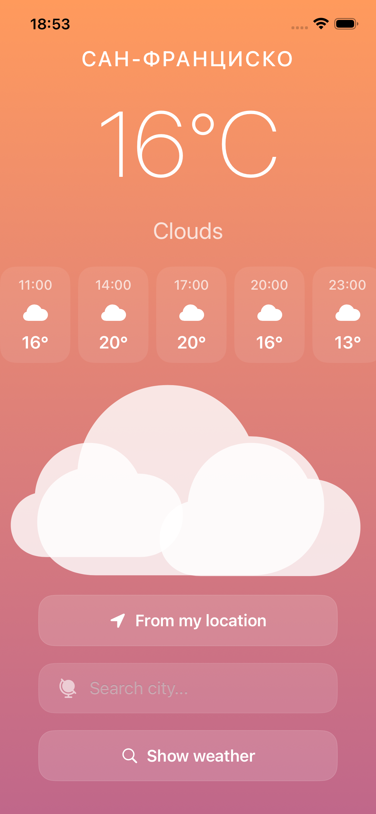
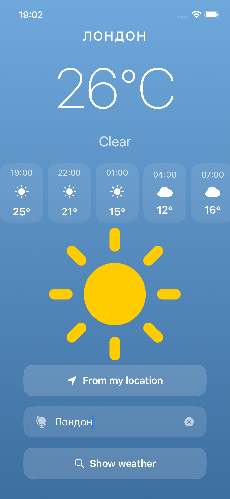
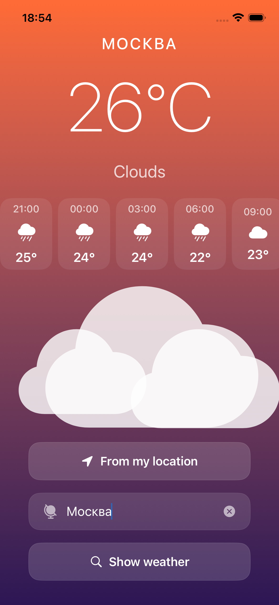
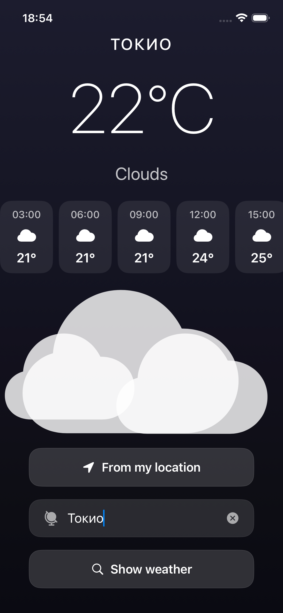

# 🌤 SkyWise

Учебное приложение погоды на SwiftUI.

## Возможности

- Просмотр текущей погоды
- Прогноз на ближайшие часы
- Поиск по городу
- Определение геолокации
- Анимации погодных условий
- Смена фона в зависимости от времени суток
- Сохранение последнего города через UserDefaults

## Стек

- SwiftUI
- MVVM
- async/await
- CoreLocation
- REST API (OpenWeatherMap)
- Codable
- UserDefaults
- Git

## Скриншоты

  
  
  
  

